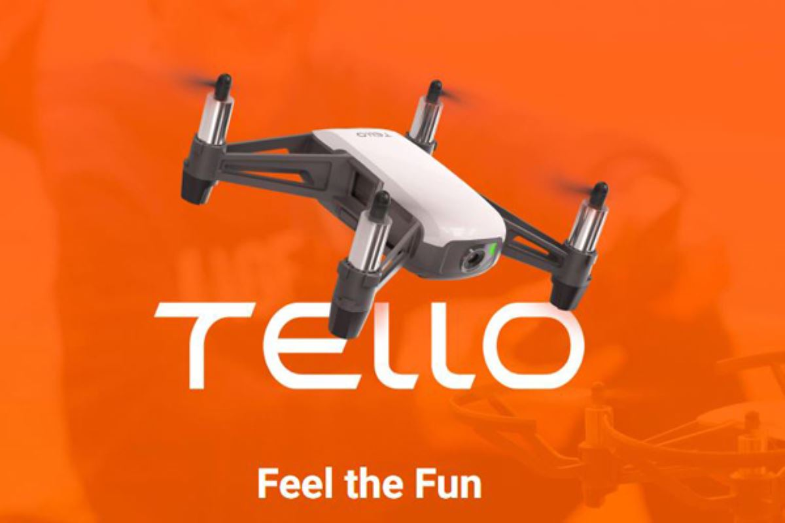
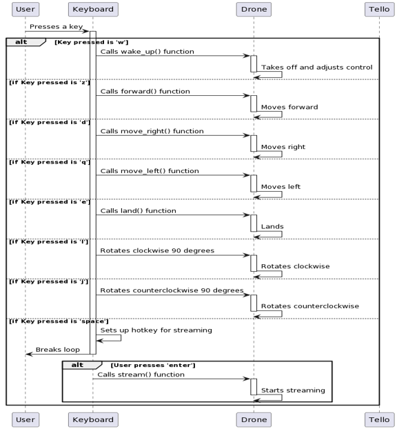
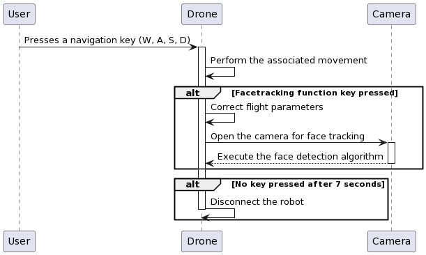
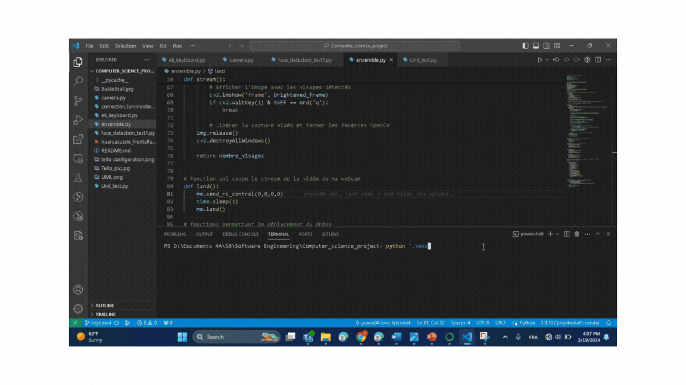

# Tello Control's Keyboard
<div style="text-align: center">
  
</div>

Authors:
-   Yvana TOUKO
-   Nelson KUATE

Supervisor:
- Kevin DESCHARRIERE

 ## Table of Contents
 1. [Project Goal](#project-goal)
 2. [Tello drone configuration](#tello-drone-configuration)
 3. [Required Libraries](#required-libraries)
 4. [Installing the required libraries](#installing-the-required-libraries)
 5. [Work plan](#work-plan)
 6. [Project Worflow](#project-workflow)
 7. [Demo Videos](#demo-videos)


## Project Goal
**Experience working with python's code and dealing with python's libraries stuff**

The aim of our project is to work with a mobile robot, in this case the Tello robot, to control its movement and use it for facial recognition. First, we'll take the robot in hand and visit the main functionalities offered by the libraries. Then, by implementing the keyboard library, the robot will be moved and controlled using keyboard keys. Finally, we'll implement a facial recognition algorithm. 

## Tello drone configuration
<div style="text-align: center">
  
</div>

Now that we have all the basic information about the drone, we will be able to connect to it.

```bash
me = Tello()
me.connect()
me.left_right_velocity = 0
me.for_back_velocity = 0
me.up_down_velocity = 0
me.yaw_velocity = 0
me.speed = 0
```

## Required Libraries
-   tello from djitellopy
-   opencv
-   keyboard
-   time
-   numpy
-   unittest

## Installing the required libraries
For this step, we installed all the libraries in the Anaconda virtual environment, then configured those packages to align with our project goals. Once all the libraries were properly installed, we launched the code editor and began.

After launching the code editor, we created a .py file and included the necessary libraries:

```bash
from djitellopy import Tello
import cv2 as cv
import time
import keyboard as key
import unittest
```

## Work plan

We firstly tried to treat our images by image and video processing, in order to increase it brightness.
After that, we focused ourselves on the keyboard control. As we can see on the following image, the 's' key permits us to launch de video streaming.

<div style="text-align: center">
  
</div>

## Project Workflow

After setting all those parameters, we can start to write the movenment functions

<div style="text-align: center">
  
</div>

## Demo Videos

The below videos represent some tests on the Tello drone drive, in addition the the Tello's face tracking.

| **Bright Correction test 1** | **Bright Correction test 2** |
| -------------------- | --------------------- |
|  |  |


| **Tello's navigation** |
| ------------------ |
|  |


| **Face detection** |
| ---------------- |
|  |
