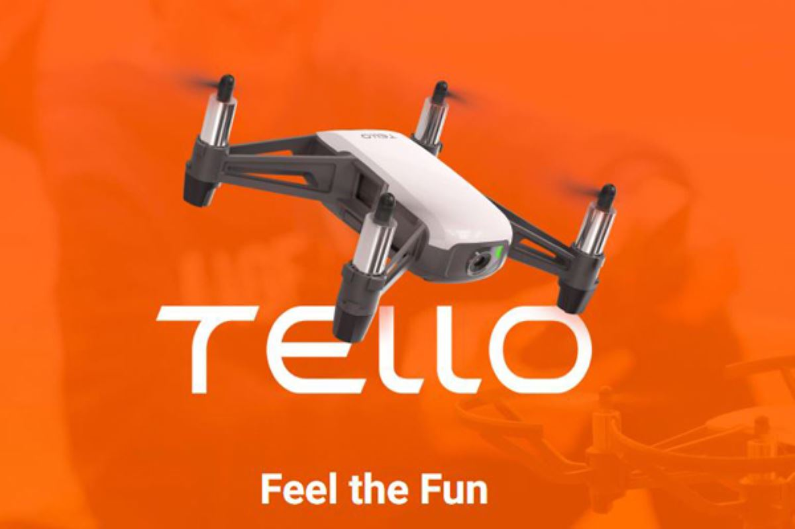
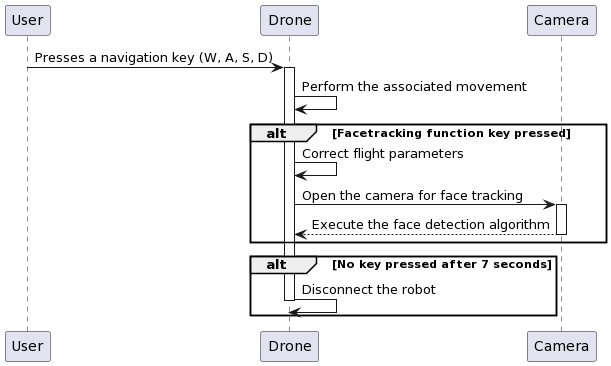

# Tello Control's Keyboard

  

Authors:
-   Yvana TOUKO
-   Nelson KUATE

Supervisor:
- Kevin

 ## Table of Contents
 1. [Project Goal](#project-goal)
 2. [Project Worflow](#project-workflow)
 3. [Required Librairies](#required-librairies)
 4. [Installing the required librairies](#installing-the-required-libraries)
 5. [Tello drone configuration](#tello-drone-configuration)
 6. [Demo videos](#demo-videos)

## Project Goal
**Experience working with python's code and dealing with python's libraries stuff**

The aim of our project is to work with a mobile robot, in this case the Tello robot, to control its movement and use it for facial recognition. First, we'll take the robot in hand and visit the main functionalities offered by the libraries. Then, by implementing the keyboard library, the robot will be moved and controlled using keyboard keys. Finally, we'll implement a facial recognition algorithm. 

## Project Workflow

  

## Required Librairies
-   tello from djitellopy
-   opencv
-   keyboard
-   time
-   numpy
-   unittest

## Installing the required librairies
For this step, we installed all the libraries in the Anaconda virtual environment, then configured those packages to align with our project goals. Once all the libraries were properly installed, we launched the code editor and began.

## Tello drone configuration

  

